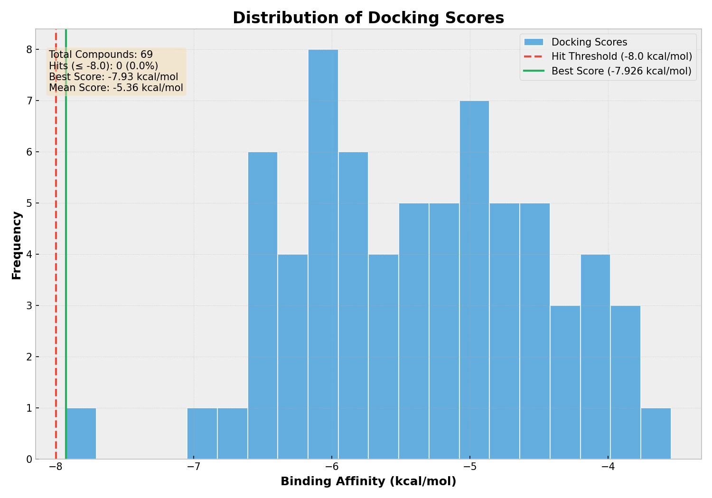
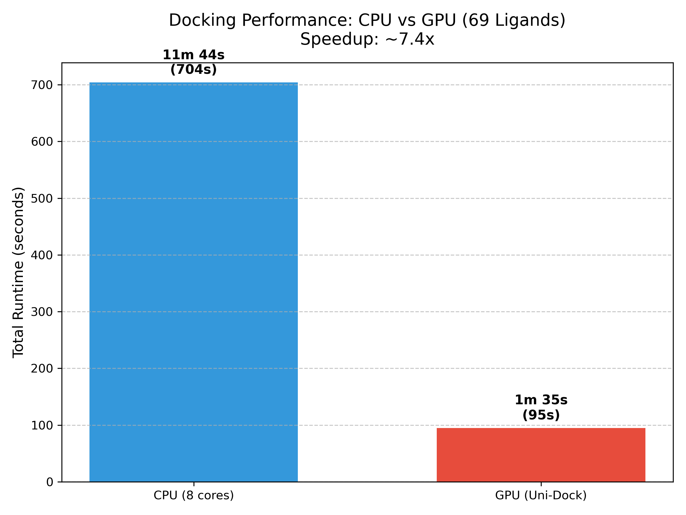

# Automated Molecular Docking Pipeline

## Overview
This pipeline automates the molecular docking process using **AutoDock Vina** (CPU) or **Uni-Dock** (GPU). It handles:
- Receptor preparation (PDB to PDBQT)
- Ligand preparation (SDF/MOL2 to PDBQT)
- **Automatic Docking Box Calculation**
- Parallel processing (GNU Parallel)
- Result summarization (CSV)
- Visualization (Histogram & Bar Chart)

## Features
- **🚀 GPU Acceleration**: Uses Uni-Dock (v1.1.3+) for ultra-fast docking (requires NVIDIA GPU).
- **⚡ Parallel CPU Docking**: Uses GNU Parallel to maximize CPU core usage.
- **📦 Auto-Box**: Automatically calculates the binding box center from the receptor.
  - *GPU Safety*: When using GPU mode, forces a safe box size (20x20x20 Å) to prevent VRAM overflow on smaller cards (e.g., RTX 3050/2050).
- **📊 Visualization**: Generates high-quality plots of binding affinities.

## Prerequisites

### 1. GPU Docking (Recommended)
Install **Uni-Dock** via Conda:
```bash
# Install Uni-Dock
conda create -n unidock_env unidock -c conda-forge
```

### 2. Dependencies (Required for both modes)

#### Option A: Conda (Recommended)
Easily install all tool and plotting dependencies:
```bash
conda install -c conda-forge openbabel parallel pandas matplotlib
```

#### Option B: Ubuntu/Debian System Packages
```bash
sudo apt update
sudo apt install -y openbabel parallel python3-pip
pip install pandas matplotlib --break-system-packages
```
*Note: You also need standard `vina` installed if you plan to run in CPU mode.*

## Configuration
Edit `docking.conf` to set your file paths and parameters:

```bash
# --- INPUT FILES ---
RECEPTOR_PDB_FILE="path/to/receptor.pdb"
LIGAND_DIR="path/to/ligands"

# --- GPU CONFIGURATION ---
USE_GPU="true"  # Set to "false" for CPU mode
# Path to Uni-Dock binary (run `which unidock` inside conda env to find it)
VINA_GPU_EXECUTABLE="/path/to/conda/envs/unidock_env/bin/unidock"

# --- DOCKING PARAMETERS ---
NUM_MODES="3"   # Number of poses to save per ligand
```

## Usage

### 1. GPU Docking (Fastest)
**Step 1: Activate Conda Environment**
```bash
conda activate unidock_env
```

**Step 2: Run the Pipeline**
```bash
bash Auto-dock.sh -c docking.conf -g -a
```
- `-c`: Path to config file.
- `-g`: Enable GPU mode (overrides config).
- `-a`: **Auto-Calculate Box**.
  - **Note**: In GPU mode, this calculates the correct *center* of the protein but forces the *size* to **20x20x20 Å** to ensure stability on GPUs with 4GB VRAM.

### 2. CPU Docking
```bash
bash Auto-dock.sh -c docking.conf -j 8
```
- `-j 8`: Run 8 concurrent jobs (adjust based on your CPU cores).

### 3. Auto-Box Command (Standalone)
You can use the helper script to calculate box coordinates manually:
```bash
# Usage: ./calculate_box.sh <pdb_file> <padding> <fixed_size>
./calculate_box.sh receptor.pdb 10 20
```

## Output
Results are saved in `output_YYYY-MM-DD_HH-MM-SS/`:
- **`summary_results.csv`**: Table of all docking scores.
- **`scores_histogram.png`**: Distribution plot and bar chart of best scores.
- **`all_docked_hits.sdf`**: Combined SDF file of all best poses.
- **`vina_outputs/`**: Individual PDBQT output files for each ligand.

## Example Results
The pipeline automatically generates visualizations of the docking scores:

### Binding Affinity Distribution


### Top Ligand Scores


### Performance Comparison (CPU vs GPU)
Benchmarking on 69 ligands shows a **~7.4x speedup** using GPU acceleration (Uni-Dock) compared to 8-core CPU docking.


## Troubleshooting
- **Exit Code 139 (Segfault)**: Usually caused by a docking box that is too large for your GPU VRAM. Use the `-a` flag in GPU mode (confirms safe 20Å box) or manually set `SIZE_X/Y/Z` to 20 in `docking.conf`.
- **"conda not found"**: Ensure you have initialized conda or sourced the profile script (e.g., `source ~/miniconda3/etc/profile.d/conda.sh`).
- **No plots generated**: Ensure you have `python3`, `pandas`, and `matplotlib` installed. The script silently skips plotting if these are missing.

## License
MIT License.
